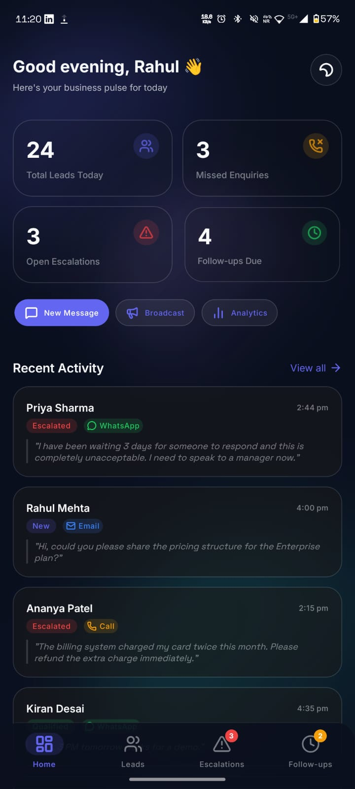
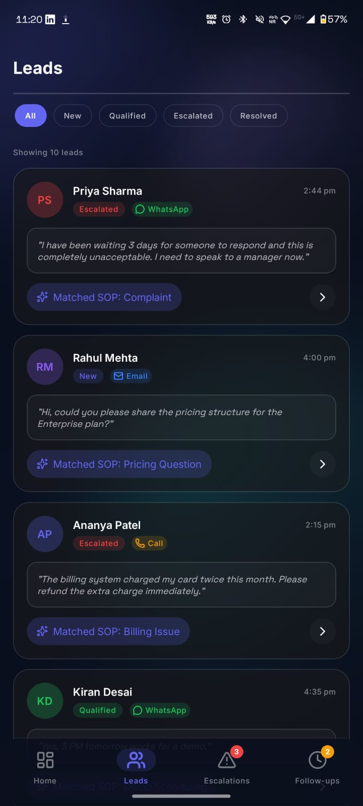
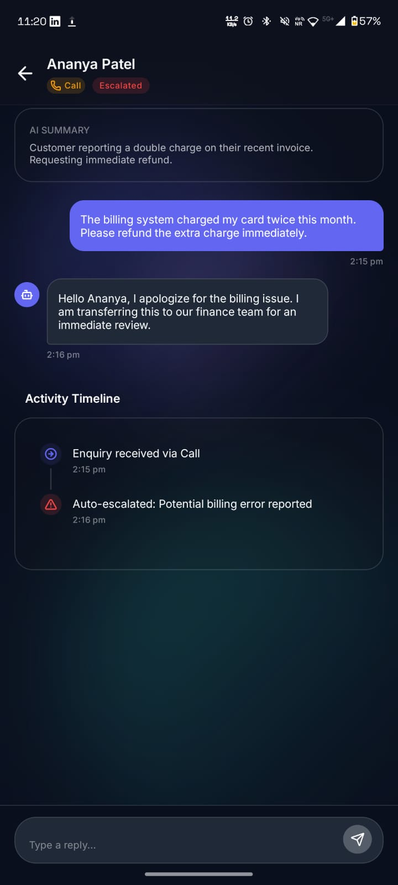

# Closira — Engineering Internship Submission

A full-stack prototype of Closira's customer enquiry pipeline — REST API with async processing, and a cross-platform mobile dashboard with light/dark theming.

[](https://python.org)
[](https://fastapi.tiangolo.com)
[](https://reactnative.dev)
[](https://sqlite.org)
[](https://opensource.org/licenses/MIT)
[]()

---

## What Closira Does

SMBs constantly lose revenue to missed enquiries. A customer messages a WhatsApp business account at 11pm, no staff is awake to qualify the lead, and by morning, the customer has moved on. Furthermore, when enquiries come in across WhatsApp, email, and phone calls, there is rarely visibility into what was said or what action was taken. Closira solves this by unifying inbound communication and automatically processing it using business-defined rules.

By supporting WhatsApp, email, and phone, the platform captures leads where customers naturally communicate. The core of the system is the Standard Operating Procedure (SOP) engine. Instead of relying on unpredictable generative AI to invent responses, businesses define explicit playbooks. When an enquiry arrives, the engine matches it against these playbooks to determine the exact next step—ensuring speed and complete predictability.

This prototype focuses strictly on the core pipeline: omnichannel ingestion, asynchronous SOP matching, automated escalations, and the mobile dashboard for business owners to monitor the flow. It intentionally omits multi-tenancy, authentication, and live LLM integration. These are conscious scoping decisions to maintain focus on the architecture of the async pipeline and the fluid UI/UX of the dashboard.

## Repository Structure

```text
closira/
├── backend/          # FastAPI service — enquiry API + async worker
├── frontend/         # Expo React Native app — business owner dashboard
└── README.md         # You are here
```

### Backend Structure
```text
backend/
├── app/
│   ├── main.py           # App init, router registration, lifespan hooks
│   ├── config.py         # Environment config via pydantic-settings
│   ├── database.py       # SQLite engine + session factory
│   ├── models/           # SQLAlchemy ORM models
│   ├── schemas/          # Pydantic request/response schemas
│   ├── routers/          # Route handlers (thin — logic lives in services)
│   ├── services/         # Business logic layer
│   ├── workers/          # Background task: SOP matching + auto-escalation
│   ├── exceptions/       # Custom exception classes + global handlers
│   └── logger.py         # Structured JSON logger
├── tests/
├── closira.http          # REST Client test file — all 5 endpoints
├── requirements.txt
└── README.md             # Backend-specific setup (mirrors this section)
```

### Frontend Structure
```text
frontend/
├── app/                  # Expo Router screens
│   ├── (tabs)/           # Tab navigator + 4 tab screens
│   └── conversation/     # Stack screen — conversation detail
├── components/           # All UI components, split by feature
├── context/              # ThemeContext — light/dark mode state
├── constants/            # Colors, spacing, typography tokens
├── hooks/                # useTheme, useAnimatedPress, useEnquiry
├── mock/                 # Hardcoded API-shaped data
├── types/                # TypeScript interfaces
└── README.md             # Frontend-specific setup
```

## Backend — Setup & Run

### Prerequisites
Python 3.11 or above.
Check with: 
```bash
python --version
```

### Installation

1. Clone and enter the backend directory:
   ```bash
   git clone <repo-url>
   cd closira/backend
   ```

2. Create and activate a virtual environment:
   ```bash
   python -m venv venv
   source venv/bin/activate      # macOS / Linux
   venv\Scripts\activate         # Windows
   ```

3. Install dependencies:
   ```bash
   pip install -r requirements.txt
   ```

4. Copy environment config:
   ```bash
   cp .env.example .env
   ```
   *(No changes needed for local development — SQLite runs file-based.)*

5. Start the server:
   ```bash
   uvicorn app.main:app --reload
   ```

6. Verify it is running:
   ```bash
   curl http://localhost:8000/health
   ```
   Expected: 
   ```json
   { "status": "ok", "database": "connected", "timestamp": "..." }
   ```

### Interactive Docs
FastAPI's auto-generated docs are the fastest way to explore the API:
- `http://localhost:8000/docs` ← Swagger UI
- `http://localhost:8000/redoc` ← ReDoc

Every endpoint has a description and example payload inline. No Postman required — `/docs` is the full API explorer.

### Environment Configuration (.env.example)
```env
DATABASE_URL=sqlite:///./closira.db
LOG_LEVEL=INFO
APP_ENV=development
```
- `DATABASE_URL`: Defines the SQLAlchemy connection string; currently set to a local file-based SQLite database.
- `LOG_LEVEL`: Controls the verbosity of the structured JSON logger.
- `APP_ENV`: Indicates the runtime environment, useful for toggling debug features or CORS policies.

## Backend — API Reference

| Method | Endpoint                    | Description                          |
|--------|-----------------------------|--------------------------------------|
| POST   | `/enquiry`                    | Submit a new inbound enquiry         |
| POST   | `/enquiry/{id}/followup`      | Schedule a follow-up                 |
| POST   | `/enquiry/{id}/escalate`      | Manually escalate to human agent     |
| GET    | `/enquiry/{id}/history`       | Full conversation history + timeline |
| GET    | `/health`                     | API + database health check          |

### POST /enquiry
Ingests a new customer enquiry from any channel and begins asynchronous processing.

Request Body:
```json
{
  "customer_name": "Priya Sharma",
  "channel": "whatsapp",
  "message": "What are your pricing plans?"
}
```

Response — `202 Accepted`:
```json
{
  "enquiry_id": "b3f1a2d4-...",
  "status": "open",
  "message": "Enquiry received. Processing in background."
}
```
The response is immediate — the background task that matches this message to an SOP runs asynchronously and does not block the caller.

Error Conditions:
| Status | Condition                    |
|--------|------------------------------|
| 422    | Invalid channel value        |
| 422    | Missing required fields      |

### POST /enquiry/{id}/followup
Request Body:
```json
{
  "delay_minutes": 30,
  "message_template": "Hi {customer_name}, just checking in…"
}
```
Response — `201 Created`:
```json
{
  "id": "f8a7e2b1-...",
  "enquiry_id": "b3f1a2d4-...",
  "delay_minutes": 30,
  "message_template": "Hi {customer_name}, just checking in…",
  "scheduled_at": "2025-05-23T09:44:00Z",
  "status": "pending"
}
```

Error Conditions:
| Status | Condition                    |
|--------|------------------------------|
| 404    | Enquiry ID not found         |
| 409    | Enquiry already resolved     |

### POST /enquiry/{id}/escalate
Request Body:
```json
{
  "reason": "Customer requesting immediate callback from senior staff"
}
```

Response — `200 OK`:
```json
{
  "enquiry_id": "b3f1a2d4-...",
  "status": "escalated",
  "message": "Enquiry escalated successfully."
}
```

Error Conditions:
| Status | Condition                    |
|--------|------------------------------|
| 409    | Conflict: Enquiry already escalated |

### GET /enquiry/{id}/history
Returns the full state of the enquiry, its event timeline, and pending follow-ups.

Response:
```json
{
  "enquiry": {
    "id": "b3f1a2d4-...",
    "customer_name": "Priya Sharma",
    "channel": "whatsapp",
    "message": "What are your pricing plans?",
    "status": "resolved",
    "matched_sop": "Pricing Question",
    "created_at": "2025-05-23T09:14:00Z"
  },
  "timeline": [
    {
      "event_type": "enquiry_created",
      "description": "Enquiry received via whatsapp",
      "created_at": "2025-05-23T09:14:00Z"
    }
  ],
  "followups": [
    {
      "id": "f8a7e2b1-...",
      "scheduled_at": "2025-05-23T09:44:00Z",
      "status": "pending"
    }
  ]
}
```

### GET /health
Health check endpoint for load balancers and monitoring tools.

Response — Healthy:
```json
{
  "status": "ok",
  "database": "connected",
  "timestamp": "2025-05-23T09:14:00Z"
}
```

Response — Degraded:
```json
{
  "status": "degraded",
  "database": "unreachable",
  "timestamp": "2025-05-23T09:14:00Z"
}
```
Returns 200 in both cases — the caller decides how to handle degraded state. 503 would be appropriate in production, but for a prototype the distinction is surfaced in the response body rather than the status code.

## Backend — Database Schema

### Why SQLite
For a prototype that runs on a single machine with no concurrent write contention, SQLite is the right choice. It requires zero infrastructure — no Docker, no connection pooling, no credentials — which means a reviewer can clone this repo and be running in under two minutes.

The schema is designed with PostgreSQL migration in mind: every column type, constraint, and relationship maps directly to Postgres without changes. Switching requires one line in `.env`: `DATABASE_URL=postgresql://…`

### Schema Overview

```text
┌─────────────────────────────────────────────────────────────┐
│  enquiries                                                  │
├──────────────────┬──────────────┬───────────────────────────┤
│  id              │ TEXT (PK)    │ UUID, server-generated    │
│  customer_name   │ TEXT         │ NOT NULL                  │
│  channel         │ TEXT         │ whatsapp | email | call   │
│  message         │ TEXT         │ Original inbound text     │
│  status          │ TEXT         │ open|processing|resolved  │
│                  │              │ |escalated                │
│  matched_sop     │ TEXT         │ Set by background worker  │
│  suggested_resp  │ TEXT         │ Set by background worker  │
│  escalation_rsn  │ TEXT         │ Manual or auto-escalation │
│  created_at      │ DATETIME     │ Server timestamp          │
│  updated_at      │ DATETIME     │ Updated on every change   │
└──────────────────┴──────────────┴───────────────────────────┘
           │ 1
           │
           │ *
┌─────────────────────────────────────────────────────────────┐
│  enquiry_events                                             │
├──────────────────┬──────────────┬───────────────────────────┤
│  id              │ INTEGER (PK) │ Autoincrement             │
│  enquiry_id      │ TEXT (FK)    │ → enquiries.id            │
│  event_type      │ TEXT         │ See event types below     │
│  description     │ TEXT         │ Human-readable log entry  │
│  metadata        │ TEXT         │ JSON string, nullable     │
│  created_at      │ DATETIME     │                           │
└──────────────────┴──────────────┴───────────────────────────┘

┌─────────────────────────────────────────────────────────────┐
│  followups                                                  │
├──────────────────┬──────────────┬───────────────────────────┤
│  id              │ TEXT (PK)    │ UUID                      │
│  enquiry_id      │ TEXT (FK)    │ → enquiries.id            │
│  delay_minutes   │ INTEGER      │ NOT NULL                  │
│  message_template│ TEXT         │ Nullable, has default     │
│  scheduled_at    │ DATETIME     │ created_at + delay        │
│  status          │ TEXT         │ pending | sent | cancelled│
│  created_at      │ DATETIME     │                           │
└──────────────────┴──────────────┴───────────────────────────┘
```

**Event Types:**
| Event               | Trigger                          | Level   |
|---------------------|----------------------------------|---------|
| `enquiry_created`     | POST /enquiry                    | INFO    |
| `processing_started`  | Worker begins                    | INFO    |
| `sop_matched`         | SOP found for message            | INFO    |
| `auto_escalated`      | No SOP matched                   | WARNING |
| `manual_escalated`    | POST /enquiry/{id}/escalate      | WARNING |
| `followup_scheduled`  | POST /enquiry/{id}/followup      | INFO    |

## How the SOP Engine Works

SOPs (Standard Operating Procedures) are the core of how Closira responds to enquiries. Instead of generating a response from scratch every time, the system matches an inbound message to a predefined playbook — giving businesses predictability and control over what their AI says.

### The 5 SOPs
| SOP                    | Trigger Keywords                              |
|------------------------|-----------------------------------------------|
| Booking Enquiry        | book, appointment, schedule, slot, availability|
| Pricing Question       | price, pricing, cost, how much, quote, fee    |
| Complaint              | complaint, unhappy, refund, issue, upset      |
| After-Hours Message    | after hours, closed, weekend, when do you open|
| General Info Request   | information, tell me more, services, explain  |

### Matching Logic
The engine lowercases the inbound message and checks for the presence of any trigger keyword using simple string contains. The first SOP whose keywords appear in the message wins — order matters and is intentional (complaints are checked before general info).

If no SOP matches, the enquiry is automatically escalated and flagged for human review. This is a deliberate product decision: it is safer to route an unrecognised message to a human than to respond with something generic and wrong.

### Why Not AI Matching
Keyword matching is faster, cheaper, deterministic, and auditable. For an SMB platform where business owners define their own SOPs, predictability matters more than sophistication. An owner needs to be able to say 'when someone mentions pricing, this is what we reply' — not debug why a language model misclassified a message.

In production, this engine would sit behind an interface where business owners manage their own SOPs with custom keywords and response templates.

## Async Processing Decision

When a new enquiry arrives, the API returns immediately with a job ID and fires a background task to match the message against SOPs. This design ensures the caller never waits on processing — critical when the inbound channel is WhatsApp and the customer expects an instant acknowledgement.

### FastAPI BackgroundTasks vs Celery

| Concern              | BackgroundTasks          | Celery                    |
|----------------------|--------------------------|---------------------------|
| Infrastructure       | Zero — same process      | Redis or RabbitMQ broker  |
| Setup complexity     | None                     | Medium                    |
| Task persistence     | None — lost on crash     | Persisted in broker       |
| Horizontal scaling   | Not supported            | Fully supported           |
| Retry on failure     | Manual                   | Built-in                  |
| Monitoring           | Logs only                | Flower dashboard          |
| Right for prototype  | ✓ Yes                    | Overkill                  |
| Right for production | Depends on load          | Yes, above ~100 req/min   |

I chose BackgroundTasks over Celery because this prototype does not need a distributed task queue — the overhead of running a broker (Redis/RabbitMQ) would outweigh the benefit at this scale. For this prototype, BackgroundTasks is the correct choice. There is no broker to run, no worker process to manage, and no network call between the API and the task runner. An evaluator can clone this repo and run one command — no Docker Compose, no Redis, no environment gymnastics.

The switch to Celery is intentionally designed to be surgical. The worker function in `enquiry_worker.py` has no FastAPI-specific imports — it takes a plain `enquiry_id` and a database session. Replacing BackgroundTasks with a Celery task is a 10-line change to the router. The business logic does not move.

## Structured Logging

Every key event in the enquiry lifecycle emits a structured JSON log entry. This makes logs machine-parseable from day one — ready for ingestion into Datadog, Loki, or CloudWatch without a parser change.

`enquiry_created`:
```json
{"timestamp": "2025-05-23T09:14:00Z", "level": "INFO", "event": "enquiry_created", "enquiry_id": "b3f1a2d4-...", "channel": "whatsapp", "customer": "Priya Sharma"}
```

`sop_matched`:
```json
{"timestamp": "2025-05-23T09:14:01Z", "level": "INFO", "event": "sop_matched", "enquiry_id": "b3f1a2d4-...", "sop": "Pricing Question"}
```

`auto_escalated`:
```json
{"timestamp": "2025-05-23T09:14:01Z", "level": "WARNING", "event": "auto_escalated", "enquiry_id": "b3f1a2d4-...", "reason": "No SOP matched for inbound message"}
```

Log level is configurable via `LOG_LEVEL` in `.env`. In production, set to WARNING to reduce noise while retaining all actionable signals.

## Testing the API

The `closira.http` file at the root of `/backend` is a REST Client file (VS Code extension: `humao.rest-client`) that covers all five endpoints in logical order.

To test a complete enquiry lifecycle:
1. `POST /enquiry` — creates the enquiry, fires background task
2. Wait 1–2 seconds for background processing
3. `GET /enquiry/{id}/history` — confirm SOP was matched
4. `POST /enquiry/{id}/followup` — schedule a follow-up
5. `GET /enquiry/{id}/history` — confirm followup appears in timeline
6. `POST /enquiry/{id}/escalate` — manually escalate
7. `GET /enquiry/{id}/history` — confirm final state

Alternatively, to create an enquiry via curl:
```bash
curl -X POST http://localhost:8000/enquiry \
  -H "Content-Type: application/json" \
  -d '{
    "customer_name": "Priya Sharma",
    "channel": "whatsapp",
    "message": "What are your pricing plans for small businesses?"
  }'
```

## Frontend — Setup & Run

### Prerequisites
Node.js 18 or above, and Expo Go installed on a phone OR an iOS/Android simulator on the machine.

### Installation

1. `cd closira/frontend`
2. `npm install`
3. `npx expo start`
4. Scan QR code with Expo Go (iOS: Camera app, Android: Expo Go app)
   OR press `i` (iOS simulator) / `a` (Android emulator)

### Running on Web
```bash
npx expo start --web
```
Note: BlurView effects are limited on web. The app is optimised for native iOS and Android.


## Frontend — Screenshots

<div align="center">
  
  &nbsp;&nbsp;&nbsp;
  
  &nbsp;&nbsp;&nbsp;
  
</div>

### Demo Video

Frontend :- https://drive.google.com/file/d/1qrMPugzyuPaj-2kN3bLNL_EjIsKV6lkE/view?usp=sharing


Backend :- https://drive.google.com/file/d/1L4bCdTgJuNU3bFcQaZ69Rr3RcNLpmQZ0/view?usp=sharing

## Frontend — Screen Reference

| Screen              | Route                    | Access                |
|---------------------|--------------------------|-----------------------|
| Dashboard           | `/(tabs)/`                 | Bottom tab — Home     |
| Leads               | `/(tabs)/leads`            | Bottom tab — Leads    |
| Escalations         | `/(tabs)/escalations`      | Bottom tab — Escalate |
| Follow-ups          | `/(tabs)/followups`        | Bottom tab — Follow   |
| Conversation Detail | `/conversation/[id]`       | Tap any lead/escalation|

**Dashboard:**
The home screen gives a business owner their day at a glance — total leads, missed enquiries, open escalations, and follow-ups due. Stat numbers animate on load. The activity feed shows the five most recent conversations. The theme toggle lives here, top-right.

**Leads:**
Full list of all inbound enquiries with real-time search and filter by status. Each card shows the channel, SOP match, and time received. Tapping navigates to the full conversation. Left border color signals status at a glance without reading text.

**Escalations:**
Escalated enquiries are surfaced here with urgency indicators. High-urgency cards pulse red to draw attention. Resolving an escalation animates the card out with an optimistic UI update — no page reload, no spinner.

**Follow-ups:**
Scheduled follow-ups sorted by urgency — overdue first, then by due time. Due time renders in green, amber, or red based on how close the deadline is. Marking as done plays a satisfying checkmark animation before the card exits.

**Conversation Detail:**
Full message thread with sender-differentiated bubbles: customer (left, glass), AI agent (right, indigo gradient), human agent (right, teal gradient). The AI summary and matched SOP are pinned above the thread. The status timeline at the bottom shows every event in the enquiry's lifecycle.

## Frontend — Theme System

The app ships with full light and dark mode support, toggled via the sun/moon button on the Dashboard. The preference is persisted to AsyncStorage and restored on next launch. On first install, the app respects the device's system appearance setting.

### How It Works
`ThemeContext` wraps the root layout and exposes `useTheme()`, which returns `{ colors, isDark, toggleTheme }`. Every component reads colors from this hook — there are zero hardcoded hex values in any component file.

```tsx
const { colors } = useTheme();

return (
  <View style={{ backgroundColor: colors.background.primary }}>
    <Text style={{ color: colors.text.primary, 
                   ...Typography.h2 }}>
      Good morning, Rahul 👋
    </Text>
  </View>
);
```

### Design Decisions

**Dark mode background:**
`#0A0F1E` — deep navy rather than pure black. Pure black (`#000000`) makes glass cards look flat because there is no contrast gradient to work with. Navy gives the glass panels room to breathe.

**Light mode background:**
`#F5F4FF` — the faintest violet tint, not white. This connects the light and dark modes visually: they share the same colour family. A business owner toggling between modes should feel continuity, not a jarring mode switch.

**Glass on light vs dark:**
Dark mode glass is low-opacity white (`rgba(255,255,255,0.06)`) — the card appears to float on the dark canvas using opacity contrast. Light mode glass is high-opacity white (`rgba(255,255,255,0.72)`) with a soft shadow — the card floats using elevation rather than opacity contrast. The BlurView intensity is higher on light (40 vs 20) to compensate for the brighter background.

**Why StyleSheet over NativeWind:**
NativeWind's support for dynamic values — opacity computed from theme state, backdrop blur, LinearGradient interop — is limited in ways that would force workarounds throughout this codebase. StyleSheet gives full control over the glass morphism and colour interpolation system this app requires. The token-based approach (colors, spacing, typography as constants) captures most of what NativeWind offers without its constraints.

## Frontend — Component Architecture

Components are organised by feature, not by type. A designer handed a new screen spec can find every relevant component by looking in one folder.

**GlassCard:**
The foundational UI primitive. Every card in the app is a GlassCard. It reads `isDark` from `useTheme()` and automatically applies the correct blur intensity, border treatment, and shadow. Callers pass children and an optional `accentColor` for the left border — they never configure glass treatment directly.

**ChannelBadge + StatusPill:**
Defined once, used everywhere. Channel colors (green/blue/amber) and status colors (indigo/green/red/grey) are semantic — they do not change between light and dark mode. This consistency is enforced by having a single component for each, never inline styles.

**BackgroundOrbs:**
Three large radial gradient circles positioned absolutely behind all content in the root layout. They give the background depth and character without moving — the visual interest comes from the colour blending, not animation. Opacity is 0.08–0.16 in dark mode, 0.06–0.08 in light mode. Rendered once in `_layout.tsx`.

## Mock Data

All data is hardcoded in `/frontend/mock/` and structured as if returned by the backend API. Field names, types, and shapes are identical to the backend's response schemas.

```typescript
export interface Enquiry {
  id: string;
  customerName: string;
  channel: 'whatsapp' | 'email' | 'call';
  message: string;
  status: 'open' | 'resolved' | 'escalated';
  matchedSop?: string;
  createdAt: string;
}
```
This interface is shared between the frontend's mock layer and what the backend actually returns. Connecting the two is a configuration change — replace mock imports with fetch calls pointing at `localhost:8000`.

| Function                | Returns                              |
|-------------------------|--------------------------------------|
| `getEnquiryById(id)`      | `Enquiry` or undefined                 |
| `getEscalations()`        | `Enquiry[]` where status = escalated   |
| `getLeads()`              | All enquiries                        |
| `getOverdueFollowUps()`   | `FollowUp[]` where dueAt < now         |
| `getDashboardStats()`     | Computed stat object for Dashboard   |

## Known Limitations

These are conscious scoping decisions for a 48-hour prototype, not gaps I am unaware of.

**Limitation 1 — No authentication:**
There is no auth layer. In production, every API endpoint would sit behind JWT-based authentication, and the mobile app would have an onboarding + login flow. The schema is tenant-aware in naming (enquiry belongs to a business) but multi-tenancy is not enforced in this build.

**Limitation 2 — No real-time updates:**
The mobile dashboard does not auto-refresh. In production, WebSockets or Server-Sent Events would push new enquiries and status changes to connected dashboards in real time. Expo supports this natively via WebSocket.

**Limitation 3 — SOP matching is order-dependent:**
The SOP engine returns the first match, which means keyword overlap between SOPs (e.g. a message that mentions both 'price' and 'appointment') resolves by order. In production this would use a scoring system — count keyword matches per SOP, return the highest scorer.

**Limitation 4 — BackgroundTasks has no retry:**
If the SOP matching task fails (e.g. a DB write error), there is no automatic retry. The error is logged and the enquiry stays in 'processing' status. Production would use Celery with retry logic and a dead-letter queue.

**Limitation 5 — Follow-up delivery is simulated:**
Scheduling a follow-up creates a record and a `scheduled_at` timestamp but does not actually send a message. Production would integrate a Celery beat scheduler that polls pending follow-ups and dispatches via the relevant channel API (WhatsApp Business API, SendGrid, etc).

**Limitation 6 — Animations vary on older devices:**
The frontend uses Reanimated 3 with spring physics. On lower-end Android devices (< 3GB RAM), some animations may drop frames. In production, the `useReducedMotion` hook would disable non-essential animations for accessibility.

## What Production Looks Like

If this were being prepared for production, here is what changes:

The database moves to PostgreSQL with row-level tenant isolation — every enquiry, event, and follow-up belongs to a `business_id`. The API gets JWT auth with per-business tokens. BackgroundTasks is replaced with Celery workers behind Redis, with retry policies and a Flower dashboard for monitoring. The SOP engine gets a management API so business owners can create, edit, and test their own SOPs without touching code. The mobile app connects to real endpoints, adds push notifications for new escalations (via Expo Notifications + FCM/APNs), and the theme preference syncs to the user's account rather than device storage.

None of this architecture is incompatible with what is built here — this prototype is designed to be extended, not replaced.

## Submission Notes

The backend and frontend are in the same repository under `/backend` and `/frontend` respectively. Both are independently runnable — the frontend does not depend on the backend being live (it uses mock data). The video walkthrough covers both in under 5 minutes. All trade-offs and limitations are documented above — nothing is hidden or glossed over.
